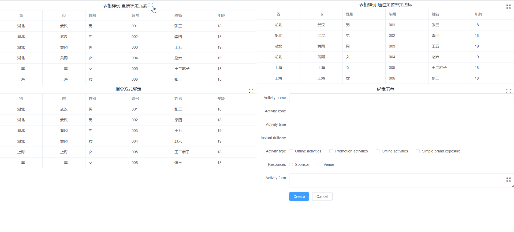

# cj-toolkit-x-full-screen
给界面上任意元素提供全屏能力的组件，并且支持按照层级全屏和取消全屏



## 配置项

| 属性名 | 说明 | 类型 | 默认值                                                                                              | 
 |----| ---- |-----| ---- | 
| targetEl | 全屏的目标元素 | HTMLElement | 非指令方式必填                                                                                          | 
| closeOnEsc |按esc 取消全屏 | boolean | true                                                                                             | 
| closeAllOnEsc | 按esc 取消所有层级的全屏 | boolean | false                                                                                            | 
| hideIcon | 是否隐藏icon | boolean | false                                                                                            | 
| autoFullScreen | 自动全屏| boolean | false                                                                                            |
| iconContainerClass | 图标放置的父元素类名 | string | 'full-screen-icon-container'                                                                     | 
| zIndex | 全屏后容器的层级 | string/function | 自动取值默认从10开始                                                                                      | 
| createIcon | 自定义创建全屏图标| function | 使用i标签                                                                                            |
| iconClass | 图标样式| ScreenFullIconClass | {class: "full-screen-icon",full: "full-screen-icon__full", unFull: "full-screen-icon__un-full"}  |
| actionListeners | 全屏动作监听器| FullScreenActionListener| FullScreenActionListener[]                                                                       ||


### 使用方法
#### 1.安装插件
```cmd
npm i @cj-toolkit-x/full-screen
```
#### 2.引入样式
```typescript
import '@cj-toolkit-x/full-screen/dist/index.css'
```
#### 3.1自定义使用
```typescript
import { FullScreen, FullScreenOptions } from '@cj-toolkit-x/full-screen'
let fullScreen: FullScreen
onMounted(() => {
    const table = document.getElementById('table-data-container')
    if (table) {
        const options: FullScreenOptions = {
            targetEl: table,// 绑定需要被全屏的元素
        }
        // 创建全屏实例
        fullScreen = new FullScreen(options)
    }
})
onUnmounted(() => {
    // 销毁全屏实例
    fullScreen1?.destory();
})
```

#### 3.2指令方式使用
a.安装vue全局指令
```typescript
// vue2指令
import { v2FullScreen } from '@cj-toolkit-x/full-screen'
Vue.directive("full-screen", v2FullScreen);

// vue3 指令
import { v3FullScreen } from '@cj-toolkit-x/full-screen'
createApp(App).directive('full-screen', v3FullScreen)
```
b.业务中使用
```html
<!-- 通过指令方式绑定-->
<div class="item table-data-container" v-full-screen="fullScreenOptions">
  <span class="title">指令方式绑定</span>
  <el-table :data="data" highlight-current-row border>
    <el-table-column label="省" prop="province" align="center"></el-table-column>
    <el-table-column label="市" prop="city" align="center"></el-table-column>
    <el-table-column label="性别" prop="gender"></el-table-column>
    <el-table-column label="编号" prop="code"></el-table-column>
    <el-table-column label="姓名" prop="cnName"></el-table-column>
    <el-table-column label="年龄" prop="age"></el-table-column>
  </el-table>
</div>
<script lang="ts" setup>
    // 指令绑定的配置项
    const fullScreenOptions = {}
</script>
```

#### 4.监听全屏和取消全屏事件实现动态修改textarea的高度
```typescript
const fullScreenOptions: FullScreenOptions = {
  // zIndex: 1000, // 手动指定zIndex
  // closeAllOnEsc: true, // 按ESC 的时候取消所有的全屏效果
  actionListeners: {
    /**
     * 全屏修改rows
     */
    fullScreen (fullScreen: FullScreen) {
      const { targetEl } = fullScreen
      const children = targetEl.getElementsByTagName('textarea')
      for (let i = 0; i < children.length; i++) {
        const child = children[i]
        const oldRows = child.getAttribute('rows')
        child.setAttribute('rows', '50')
        oldRows && child.setAttribute('oldRows', oldRows)
      }
    },
    /**
     * 取消全屏文本域恢复
     */
    cancelFullScreen (fullScreen: FullScreen) {
      const { targetEl } = fullScreen
      const children = targetEl.getElementsByTagName('textarea')
      for (let i = 0; i < children.length; i++) {
        const child = children[i]
        const oldRows = child.getAttribute('oldRows') || '2'
        child.removeAttribute('oldRows')
        oldRows && child.setAttribute('rows', oldRows)
      }
    }
  }
}
```
#### 5.样式覆盖
| 样式名称                         | 备注                                       |
|------------------------------|------------------------------------------|
| full-screen-container        | 全屏目标容器(自动添加)                             |
| full-screen-container__full  | 目标容器进入全屏状态                               |
| full-screen-icon             | 全屏图标,可通过options.iconClass.class 设置       |
| full-screen-icon__full       | 全屏图标-全屏,可通过options.iconClass.full 设置     |
| full-screen-icon__un-full    | 全屏图标-取消全屏,可通过options.iconClass.unFull 设置 |
| full-screen-icon-container   | 全屏目标容器，如果全屏元素的子元素中存在此类名，则会以此元素作为全屏图标的父元素 |

#### 6.常见问题
1.如果全屏后界面显示异常，请先检查是否在元素上设置了zIndex,
2.

demo代码地址:https://github.com/chenJJ20180912/cj-toolkit-x-demo/blob/master/src/views/full-screen/index.vue
